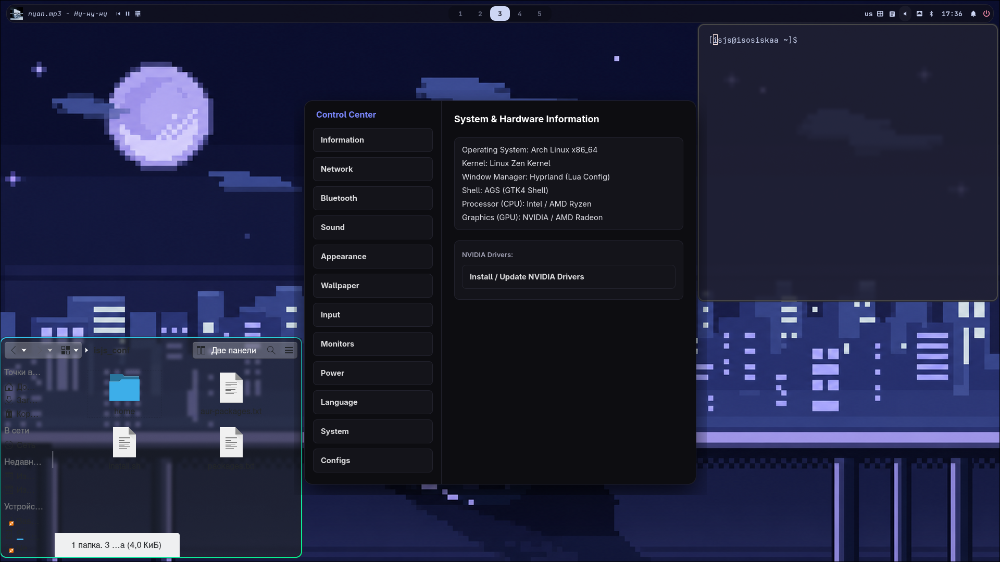

🌙 Dark Pixel Hyprland: My Custom Setup & AGS Control CenterThis is my personal Hyprland desktop environment configuration built for Arch Linux. I wanted to combine a cozy, dark pixel-art aesthetic with a flexible Lua-based config and a completely custom GTK4 dashboard made with AGS (Aylur's GTK Shell).✨ Features & The Custom Control CenterInstead of memorizing dozens of terminal commands, I built a dedicated GUI Control Center from scratch using GTK4/AGS. It lets me manage the whole system with simple toggles and buttons:ℹ️ Specs & Hardware: Quick system info overview and automated scripts to handle NVIDIA driver installation/updates.🌐 Networking: Quick-toggle Wi-Fi connections via a clean GUI or drop straight into nmtui.📡 Bluetooth Support: One-click toggles for Bluetooth services and a fast shortcut to launch blueman-manager.🔊 Audio Control: Granular PipeWire volume adjustments (±5% steps), instant mute, and a direct link to pavucontrol.🖼️ Wallpapers: Native integration with Waypaper for switching backgrounds on the fly.🖱️ Input Tweaks: Toggle natural scrolling instantly and jump straight into editing hyprland.lua via quick shortcuts.🖥️ Display Settings:Auto-config for high-refresh-rate gaming monitors (165Hz+).Quick backlight brightness slider (±10% steps).Manual screen resolution and positioning layout powered by hl.monitor.

